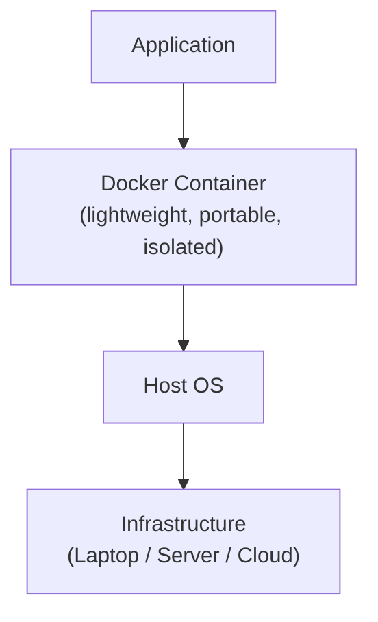
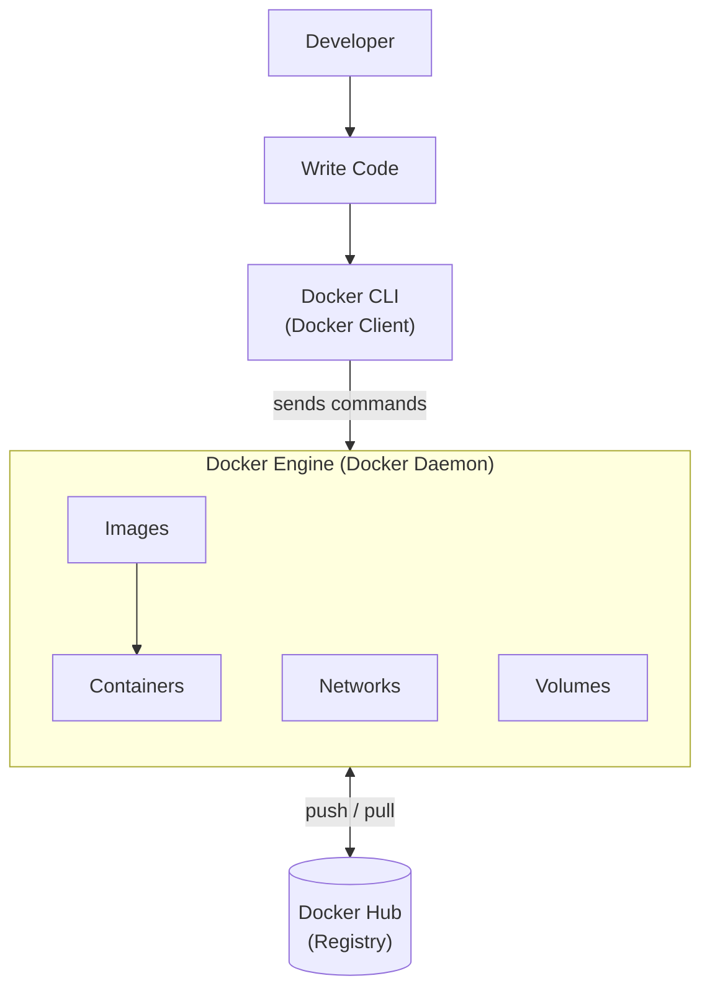
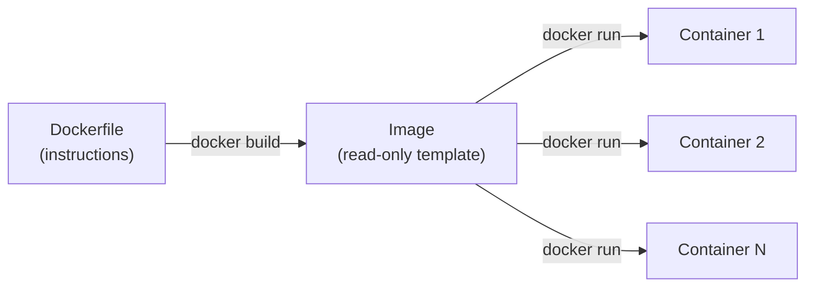
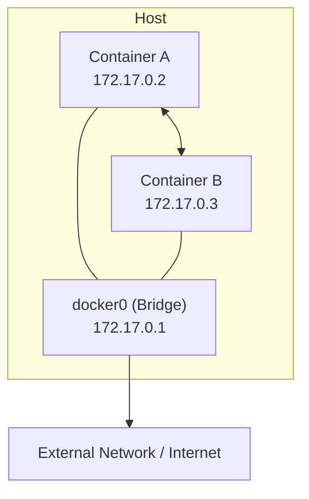
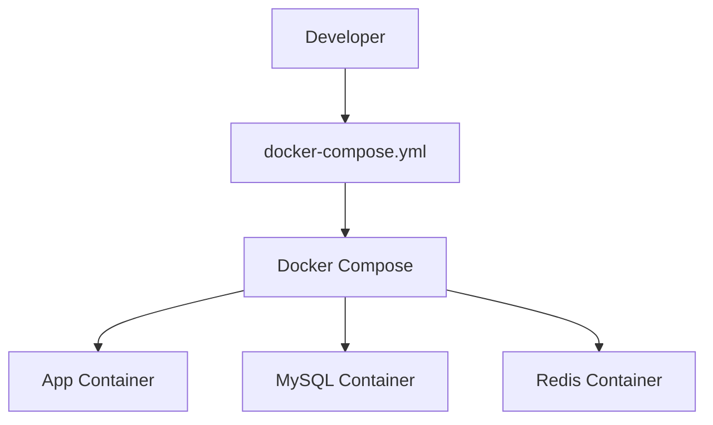
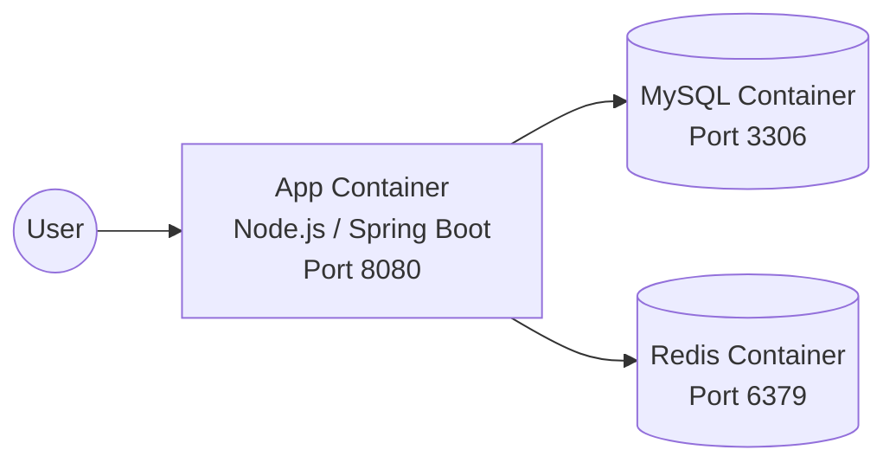
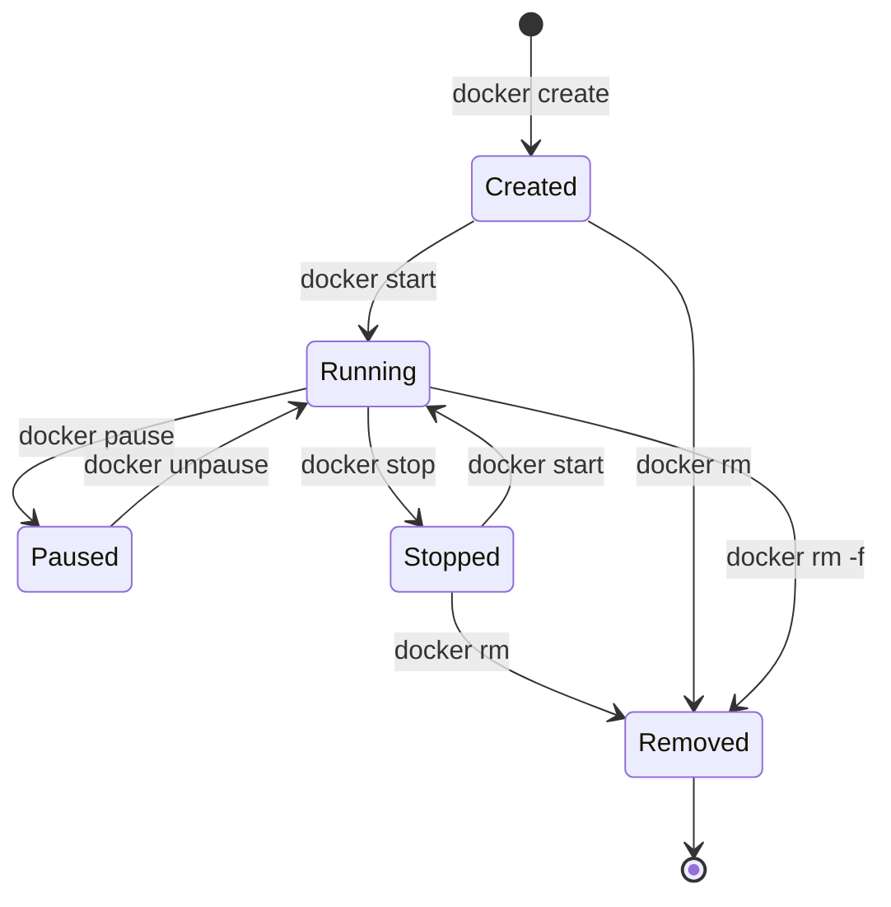

#  Docker Notes 🐳

A concise, visual guide to learning Docker from scratch: concepts, architecture, Dockerfile, networking, storage, Compose, and a command cheat sheet.

> ⭐ If these notes help you, consider starring the repo and sharing it.

---

##  Table of Contents

1. [Introduction](#1-introduction)
2. [Docker Architecture](#2-docker-architecture)
3. [Image vs Container vs Dockerfile](#3-image-vs-container-vs-dockerfile)
4. [Dockerfile Explained](#4-dockerfile-explained)
5. [Docker Networking](#5-docker-networking)
6. [Storage in Docker](#6-storage-in-docker)
7. [Docker Compose](#7-docker-compose)
8. [Container Lifecycle & Image Layers](#8-container-lifecycle--image-layers)
9. [Commands Cheat Sheet](#9-commands-cheat-sheet)

---

## 1. Introduction

### 1.1 What is Docker?

Docker is an **open-source platform** that helps us **build, ship and run** applications inside **containers**. It allows an application to run consistently on any environment.



### 1.2 Why was Docker created?

Before Docker, developers faced many issues while deploying applications:

-  The *"it works on my machine"* problem
-  Different environments (dev / test / prod)
-  Heavy virtual machines
-  Complex configuration
-  Slow deployment

### 1.3 Benefits of Docker

| Benefit | Description |
|---|---|
| **Lightweight** | Containers are smaller and use fewer resources |
| **Portable** | Build once and run anywhere |
| **Consistent** | Same environment everywhere |
| **Fast deployment** | Start containers in seconds |
| **Isolation** | Each container runs isolated from the others |
| **Scalability** | Easy to scale applications |

### 1.4 VM vs Docker

```text
   Virtual Machine (VM)                 Docker (Container)
 ┌───────┐ ┌───────┐ ┌───────┐        ┌───────┐ ┌───────┐ ┌───────┐
 │  App  │ │  App  │ │  App  │        │  App  │ │  App  │ │  App  │
 │Bins/  │ │Bins/  │ │Bins/  │        │Bins/  │ │Bins/  │ │Bins/  │
 │Libs   │ │Libs   │ │Libs   │        │Libs   │ │Libs   │ │Libs   │
 ├───────┤ ├───────┤ ├───────┤        └───────┴─┴───────┴─┴───────┘
 │Guest  │ │Guest  │ │Guest  │        ┌─────────────────────────────┐
 │  OS   │ │  OS   │ │  OS   │        │        Docker Engine        │
 └───────┘ └───────┘ └───────┘        ├─────────────────────────────┤
 ┌─────────────────────────────┐      │           Host OS           │
 │         Hypervisor          │      ├─────────────────────────────┤
 ├─────────────────────────────┤      │       Infrastructure        │
 │           Host OS           │      └─────────────────────────────┘
 ├─────────────────────────────┤         Lightweight & Fast
 │       Infrastructure        │
 └─────────────────────────────┘
    Heavy & Slow
```

| | Virtual Machine | Docker Container |
|---|---|---|
| **Isolation level** | Full OS per VM (hypervisor) | Process-level, shares host kernel |
| **Startup time** | Minutes | Seconds |
| **Size** | GBs | MBs |
| **Overhead** | High | Low |

---

## 2. Docker Architecture

Docker follows a **client-server architecture**. The **Docker Client** communicates with the **Docker Daemon (Docker Engine)**, which builds, runs and manages Docker containers.



### Components

| # | Component | Description |
|---|---|---|
| 1 | **Docker Client (CLI)** | Command line tool used to send commands to the Docker Daemon |
| 2 | **Docker Daemon (Engine)** | Core of Docker. Builds images, runs containers, manages networks and volumes |
| 3 | **Docker Images** | Read-only templates used to create containers |
| 4 | **Docker Containers** | Running instances of images. Lightweight, portable and isolated |
| 5 | **Docker Hub (Registry)** | Cloud-based registry service. Push your images to it or pull official ones |
| 6 | **Networks** | Communication between containers and with the outside world. Types: `bridge`, `host`, `none`, `overlay` |
| 7 | **Volumes** | Store data generated by containers. Data persists even if the container is removed |

### How it works

1. We give commands through the **Docker CLI**
2. The CLI talks to the **Docker Daemon**
3. The Daemon **pulls images** from Docker Hub (if not present locally)
4. It **creates and runs containers**
5. It **manages networks and volumes**

---

## 3. Image vs Container vs Dockerfile

- **Dockerfile**: a text file with *instructions* to build an image.
- **Image**: a blueprint (read-only template).
- **Container**: a running instance of an image.



### Image vs Container

| Feature | Image | Container |
|---|---|---|
| **Definition** | Blueprint or template (read-only) | Running instance of an image |
| **State** | Static | Dynamic |
| **Change** | Cannot be changed | Can be changed |
| **Life** | Permanent until deleted | Temporary, can be stopped / removed |
| **Size** | Larger | Smaller (only a thin writable layer on top) |
| **Purpose** | To create containers | To run applications |
| **Examples** | `ubuntu:22.04`, `mysql:8`, `nginx:latest` | A running `nginx` or `mysql` container |

### Docker lifecycle (simple flow)


### Key points

- An image is **built once** and can be used to create **multiple containers**.
- Containers are **isolated, portable and lightweight**.
- Docker ensures **"Build once, Run anywhere"**.
- Containers **share the host OS kernel**, that's why they are lightweight.

---

## 4. Dockerfile Explained

A **Dockerfile** is a text file that contains a set of instructions to build a Docker image **automatically**.

### Sample Dockerfile

```dockerfile
FROM openjdk:17-jdk-slim          # Base image
WORKDIR /app                      # Set working directory
COPY app.jar .                    # Copy file to container
ENV APP_ENV=production            # Set environment variable
EXPOSE 8080                       # Expose port
CMD ["java", "-jar", "app.jar"]   # Command to run app
```

>  **Note:** Each instruction creates a **layer** in the image. If a layer doesn't change, Docker uses the **cache** to build faster.

### Important instructions

| Instruction | Description |
|---|---|
| `FROM` | Specifies the base image to start with |
| `WORKDIR` | Sets the working directory inside the container |
| `COPY` | Copies files or directories from host to container |
| `ADD` | Similar to `COPY`, also supports URLs and auto-extracts `.tar` files |
| `ENV` | Sets environment variables inside the container |
| `EXPOSE` | Informs Docker that the container listens on the given port |
| `RUN` | Executes a command at **build time** (e.g. install dependencies) |
| `CMD` | Specifies the default command to run when the container starts |
| `ENTRYPOINT` | Configures a container that will run as an executable |

### CMD vs ENTRYPOINT

| `CMD` | `ENTRYPOINT` |
|---|---|
| Provides default command and arguments | Configures the container to run as an executable |
| Can be overridden when running the container | Not overridden easily |
| Only one `CMD` is respected (the last one) | Only one `ENTRYPOINT` is respected (the last one) |
| Used mostly for defining default behavior | Used when the container must always run a specific program |

>  **Tip:** `ENTRYPOINT` can still be overridden with `docker run --entrypoint ...`. They are often combined: `ENTRYPOINT` is the program, `CMD` provides its default arguments.

---

## 5. Docker Networking

Docker containers can communicate with each other and with the outside world using **networks**.



### Types of networks

| Driver | Description | Use case |
|---|---|---|
| **bridge** *(default)* | Containers on the same bridge network can talk to each other. They can reach the outside network | Single-host apps |
| **host** | Container shares the host network. **No network isolation** | Max network performance |
| **none** | Container has **no network access** | Complete isolation |
| **overlay** | Connects containers across **multiple Docker hosts** (Swarm mode) | Multi-host / clusters |

---

## 6. Storage in Docker

Containers are **ephemeral**: when a container is removed, its data is lost. To **persist data**, we use **Volumes** or **Bind Mounts**.

### Volumes

- Managed by Docker
- Stored on the Docker host (`/var/lib/docker/volumes`)
- Platform independent
-  Recommended for **production**

### Bind Mounts

- Use a directory from the host
- Platform dependent
-  Good for **development** (code changes reflect immediately)

### Volume vs Bind Mount

| Feature | Volume | Bind Mount |
|---|---|---|
| **Managed by** | Docker | Host |
| **Location** | Inside Docker host area | Anywhere on host system |
| **Portability** | High | Lower (depends on host path) |
| **Backup** | Easy | Manual |
| **Best for** | Production | Development |

```bash
# Volume
docker run -v db_data:/var/lib/mysql mysql:8

# Bind mount
docker run -v $(pwd):/app node:18
```

---

## 7. Docker Compose

**Docker Compose** is a tool for defining and running **multi-container** Docker applications. With a single YAML file, we configure all the services, networks and volumes required for our app. It makes it easy to start, stop and manage the entire application.



### `docker-compose.yml` example

```yaml
services:                       # All services
  app:                          # Service name
    image: myapp:latest         # Image to use
    ports:
      - "8080:8080"             # Port mapping host:container
    depends_on:
      - mysql                   # Start mysql before app

  mysql:                        # Another service
    image: mysql:8              # MySQL image
    environment:                # Environment variables
      MYSQL_ROOT_PASSWORD: root
    volumes:
      - db_data:/var/lib/mysql  # Persist data in volume

  redis:                        # Another service
    image: redis:latest         # Redis image

volumes:
  db_data:                      # Named volume
```

>  **Notes**
> - The top-level `version:` key (e.g. `'3.8'`) is **obsolete** in Compose V2 and can be omitted.
> - `depends_on` controls **start order only**, not readiness. Use `healthcheck` + `condition: service_healthy` to wait for a service to be truly ready.
> - Never hardcode real passwords: use `.env` files or secrets. `root` here is only for demo purposes.

### Important commands

| Command | Description |
|---|---|
| `docker compose up` | Build and start all services defined in the file |
| `docker compose up -d` | Start in detached mode (in background) |
| `docker compose down` | Stop and remove all containers and networks |
| `docker compose logs` | View logs of all services |
| `docker compose ps` | List all running services |
| `docker compose build` | Build or rebuild services |

### Multi-container application example



All services share the **default network created by Compose**, so they can reach each other by **service name** (e.g. `mysql:3306`).

---

## 8. Container Lifecycle & Image Layers

### 8.1 Container lifecycle

A container goes through different states during its lifetime.



| State | Description |
|---|---|
| **Created** | Container is created but not started |
| **Running** | Container is up and running |
| **Paused** | Container is running but all processes are paused |
| **Stopped** | Container is stopped but still exists |
| **Removed** | Container is deleted and cannot be recovered |

### 8.2 Docker image layers

Docker images are built using a **layered architecture**. Each instruction in the Dockerfile adds a new layer.

```text
 ┌──────────────────────────────┐
 │ Layer N   (CMD)              │ → Final layer: defines what runs in the container
 ├──────────────────────────────┤
 │ Layer 4   (COPY . /app)      │ → Copies application code to /app
 ├──────────────────────────────┤
 │ Layer 3   (RUN npm install)  │ → Installs dependencies
 ├──────────────────────────────┤
 │ Layer 2   (WORKDIR /app)     │ → Sets working directory
 ├──────────────────────────────┤
 │ Layer 1   (FROM node:18)     │ → Specifies base image
 ├──────────────────────────────┤
 │ Base Image (node:18)         │ → Base image (read-only)
 └──────────────────────────────┘
```

**Notes**

- Layers are **read-only**.
- Only the **top writable layer** changes when a container runs.
- Docker **reuses cached layers** to build images faster.
- Smaller layers = better performance.

### 8.3 How layer caching works

| Step | First build | After code change in Step 3 | Rebuild |
|---|---|---|---|
| Step 1 |  built |  unchanged |  **cached** |
| Step 2 |  built |  unchanged |  **cached** |
| Step 3 |  built |  changed |  **rebuilt** |
| Step 4 |  built |  invalidated |  **rebuilt** |

> Only the changed layer **and all the layers above it** are rebuilt. The others are reused from cache.

💡 **Best practice:** put the instructions that change **least often** (base image, dependency install) at the top, and the ones that change **most often** (copying source code) at the bottom:

```dockerfile
FROM node:18
WORKDIR /app
COPY package*.json ./     # changes rarely → cached
RUN npm install           # re-runs only if package.json changed
COPY . .                  # changes often → last
CMD ["npm", "start"]
```

---

## 9. Commands Cheat Sheet

The most commonly used Docker commands every developer should know.

### General

| Command | Description | Example |
|---|---|---|
| `docker --version` | Check Docker version | `docker --version` |
| `docker info` | Display system-wide information | `docker info` |
| `docker login` | Login to a Docker registry | `docker login` |
| `docker logout` | Logout from a Docker registry | `docker logout` |

### Images

| Command | Description | Example |
|---|---|---|
| `docker search <image>` | Search an image on Docker Hub | `docker search nginx` |
| `docker pull <image>` | Download an image from a registry | `docker pull nginx:latest` |
| `docker images` | List all downloaded images | `docker images` |
| `docker rmi <image-id>` | Remove an image | `docker rmi nginx` |
| `docker build -t <name> .` | Build an image from a Dockerfile | `docker build -t myapp:1.0 .` |

### Containers

| Command | Description | Example |
|---|---|---|
| `docker run <image>` | Run a container | `docker run nginx` |
| `docker run -d <image>` | Run a container in detached mode | `docker run -d nginx` |
| `docker ps` | List running containers | `docker ps` |
| `docker ps -a` | List all containers (running + stopped) | `docker ps -a` |
| `docker start <container-id>` | Start a stopped container | `docker start a1b2c3d4` |
| `docker stop <container-id>` | Stop a running container | `docker stop a1b2c3d4` |
| `docker restart <container-id>` | Restart a container | `docker restart a1b2c3d4` |
| `docker rm <container-id>` | Remove a stopped container | `docker rm a1b2c3d4` |
| `docker rm -f <container-id>` | Force remove a running container | `docker rm -f a1b2c3d4` |
| `docker logs <container-id>` | View logs of a container | `docker logs a1b2c3d4` |
| `docker exec -it <container-id> bash` | Access a container shell | `docker exec -it a1b2c3d4 bash` |
| `docker inspect <container-id>` | Inspect container details | `docker inspect a1b2c3d4` |
| `docker cp <src> <container>:/dest` | Copy files/folders **to** a container | `docker cp app.py a1b2c3d4:/app` |
| `docker cp <container>:/src <dest>` | Copy files/folders **from** a container | `docker cp a1b2c3d4:/app /home/user` |

### Networks, volumes & cleanup

| Command | Description | Example |
|---|---|---|
| `docker network ls` | List all networks | `docker network ls` |
| `docker volume ls` | List all volumes | `docker volume ls` |
| `docker system prune -a` | Remove unused data (stopped containers, unused images, networks, build cache) | `docker system prune -a` |

>  **Warning:** `docker system prune -a` deletes **all unused images** too. Volumes are **not** removed unless you add `--volumes`. Use with care.

---

##  What's next?

- Multi-stage builds to shrink image size
- Healthchecks and restart policies
- Docker security best practices (non-root user, minimal base images, `.dockerignore`)
- CI/CD with Docker (GitHub Actions)
- Orchestration: Docker Swarm, Kubernetes

##  Resources

- [Official Docker documentation](https://docs.docker.com/)
- [Dockerfile reference](https://docs.docker.com/reference/dockerfile/)
- [Docker Compose documentation](https://docs.docker.com/compose/)
- [Docker Hub](https://hub.docker.com/)

---

##  Contributing

Found a typo or want to add something? Open an issue or a pull request.
